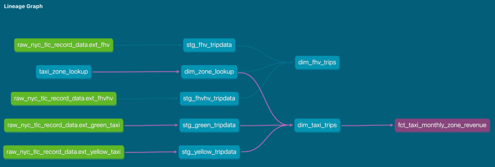

## Q1: understanding dbt model resolution
### meaning of sources.yaml
-This sources.yaml defines a source in dbt, specifically for BigQuery, __allowing dbt to reference raw data in the BigQuery__ data warehouse. \
Defines a source (raw_nyc_tripdata) → This allows dbt to refer to existing raw data.
```
version: 2 # Specifies the YAML schema version (used in dbt sources & models)

sources:
  - name: raw_nyc_tripdata  # Logical name for the source, referenced in dbt 
                            # as source('raw_nyc_tripdata', 'ext_green_taxi')
    database: "{{ env_var('DBT_BIGQUERY_PROJECT', 'dtc_zoomcamp_2025') }}"
    schema:   "{{ env_var('DBT_BIGQUERY_SOURCE_DATASET', 'raw_nyc_tripdata') }}"
    tables:
      - name: ext_green_taxi  # Table name inside the schema
      - name: ext_yellow_taxi
```
- Uses Environment Variables (env_var) for Flexibility:
    - DBT_BIGQUERY_PROJECT → Specifies the BigQuery project (defaults to dtc_zoomcamp_2025 if not set).
    - DBT_BIGQUERY_SOURCE_DATASET → Defines the schema/dataset where raw data is stored (defaults to raw_nyc_tripdata).
    - meaning: If DBT_BIGQUERY_PROJECT is set → dbt will use its value. \
      If DBT_BIGQUERY_PROJECT is not set → dbt will use 'dtc_zoomcamp_2025' as the default value. \
      The same applies to DBT_BIGQUERY_SOURCE_DATASET, which defaults to 'raw_nyc_tripdata2'.
- How to set Environment Variables?
    - Method 1: Linux/MacOS (Bash/Zsh) `export DBT_BIGQUERY_PROJECT=my_project`
    - Method 2: Windows(PowerShell) `$env:DBT_BIGQUERY_PROJECT="my_project"`
    - Method 3: .env File (if using dbt Cloud or dotenv), in this .env file: DBT_BIGQUERY_PROJECT=my_project
- Why use env_var?
  Makes it configurable across different environments (e.g., dev, staging, prod). \
  Prevents hardcoding project/schema names. \
  Allows you to set values via the command line or .env files.

## Q2: dbt Variables and Dynamic Models
Say you have to modify the following dbt_model (fct_recent_taxi_trips.sql) to enable Analytics Engineers to dynamically control the date range.

In development, you want to process only the last 7 days of trips
In production, you need to process the last 30 days for analytics
 Meaning: how to dynamically control the date range in fct_recent_taxi_trips.sql based on the environment (development vs. production)?

- Method 1: use `target.name`
```
-- .sql : automatically adjust the date range based on the DBT target (dev or prod)
WITH recent_trips AS (
    SELECT *
    FROM {{ ref('stg_taxi_trips') }}
    WHERE pickup_datetime >= DATE_SUB(CURRENT_DATE(), 
        INTERVAL 
        CASE 
            WHEN target.name = 'prod' THEN 30
            ELSE 7 
        END DAY
    )
)

SELECT * FROM recent_trips;
```
running `dbt run --target prod` will automatically process 30 days, and running `dbt run` in development will use 7 days.

- method 2:
  ```
  -- .sql
  WITH recent_trips AS (
    SELECT *
    FROM {{ ref('stg_taxi_trips') }}
    WHERE pickup_datetime >= DATE_SUB(CURRENT_DATE(), INTERVAL {{ var('trip_days', 7) }} DAY)
    --- comment: in default:Filter trips to only include records within the last trip_days
  )

  SELECT * FROM recent_trips;
  ```
In Development (Last 7 Days): `dbt run --select fct_recent_taxi_trips`
In Production (Last 30 Days): `dbt run --select fct_recent_taxi_trips --vars '{ "trip_days": 30 }'`

- explanation of options
  - meaning of "command line arguments takes precedence over ENV_VARs, which takes precedence over DEFAULT value?"
    - Precedence order（优先顺序）: Command-line arguments (--vars): Highest priority > Environment variables (env_var()):Used if no CLI argument > Default values (hardcoded in dbt): Only used if nothing else is set. __This is also called "standard precedence order" in dbt__
      - Command-line arguments (--vars) have the highest priority: If a variable is passed via the dbt CLI (--vars), it will override everything else.
      - Environment variables (env_var()) come next: If a variable isn’t provided via the command line, dbt will check if it exists as an environment variable.
      - Default values (hardcoded in dbt) have the lowest priority: If neither a CLI argument nor an environment variable is found, dbt will use the default value defined in the project.

  - pickup_datetime >= CURRENT_DATE - INTERVAL '{{ var("days_back", env_var("DAYS_BACK", "30")) }}' DAY 
    - Command-line arguments (--vars) take precedence → var("days_back", …); If not set, it checks the environment variable (DAYS_BACK) → env_var("DAYS_BACK", …); If neither is provided, it defaults to 30 days
    - How Precedence Works:
      - If dbt run --vars '{ "days_back": 7 }' is used → days_back = 7
      - If no --vars is provided but DAYS_BACK=15 is set in the environment → days_back = 15
      - If neither is set → defaults to 30
  - how to code when ENV_VAR takes precedence over command line arguments, which takes precedence over DEFAULT value?
     ``` pickup_datetime >= CURRENT_DATE - INTERVAL '{{ env_var("DAYS_BACK", var("days_back", "30")) }}' DAY ```
    
## Q3: dbt Data Lineage and Execution
- Considering the data lineage below and that taxi_zone_lookup is the only materialization build (from a .csv seed file). Select the option that does NOT apply for materializing fct_taxi_monthly_zone_revenue: (A: dbt run --select models/staging/+) \


`dbt run` :Runs all models in the project 
`dbt run --select +models/core/dim_taxi_trips.sql+ --target prod` : Runs dim_taxi_trips.sql and its dependencies (parents & children). If fct_taxi_monthly_zone_revenue depends on dim_taxi_trips.sql, it will be included.
`dbt run --select +models/core/fct_taxi_monthly_zone_revenue.sql` :Runs fct_taxi_monthly_zone_revenue along with its dependencies. 
`dbt run --select +models/core/` :Runs all models inside models/core/, which includes fct_taxi_monthly_zone_revenue.
`dbt run --select models/staging/+` :runs only models inside models/staging/ and their children. If fct_taxi_monthly_zone_revenue is in models/core/, it won't be included unless it depends directly on staging models.

- What are dependencies?  parents & children? \
  dependencies refer to the relationships between models:
    - Parent models(Upstream Dependencies): A parent is a model that another model depends on.
    - Child models(Downstream Dependencies): A child is a model that depends on another model.
  
## Q4: dbt Macros and Jinja
Consider you're dealing with sensitive data (e.g.: PII), that is only available to your team and very selected few individuals, in the raw layer of your DWH (e.g: a specific BigQuery dataset or PostgreSQL schema),
  - Among other things, you decide to obfuscate/masquerade that data through your staging models, and make it available in a different schema (a staging layer) for other Data/Analytics Engineers to explore
  - And optionally, yet another layer (service layer), where you'll build your dimension (dim_) and fact (fct_) tables (assuming the Star Schema dimensional modeling) for Dashboarding and for Tech Product Owners/Managers \
You decide to make a macro to wrap a logic around it: \
```


    
    

     {{- env_var(target_env_var) -}}
                        {{- env_var(stging_env_var, env_var(target_env_var)) -}}
    


``` 
And use on your staging, dim_ and fact_ models as:
```
{{ config(
    schema=resolve_schema_for('core'), 
) }}
``` 
### Notes for Q4: 
In dbt (Data Build Tool), __a macro is a reusable piece of SQL or Jinja code__ that allows you to eliminate duplication and enhance modularity in your dbt projects. Macros work similarly to __functions__ in programming languages—they take arguments, process them, and return a result.
How does macro work in dbt?
  - Macros are written in Jinja \
    dbt uses the Jinja templating engine to define macros. \
    Macros can contain SQL and Jinja expressions.
  - Defining a Macro \
    Macros are stored in .sql files inside the macros/ directory.
    A macro is defined using the  syntax.
  - Calling a Macro \
    Macros can be invoked using {{ macro_name(arguments) }} inside models or other macros.
  - example:
      - Define the Macro(macros/my_macros.sql)
         ```
         
            {{ a + b }}
          
         ```
      - Using the Macro in a Model (models/example.sql)
        ``` SELECT {{ add_numbers(3, 5) }} AS sum_result; ```

## Q5 Taxi Quarterly Revenue Growth (Note LAG(..) OVER (ORDER BY service_type, year_quarter))
    Common Table Expression (CTE) syntax:  ( `with cte1 as(), cte2 as(), ...`)

    EXTRACT(YEAR FROM pickup_datetime) AS year,
    EXTRACT(QUARTER FROM pickup_datetime) AS quarter,
    EXTRACT(MONTH FROM pickup_datetime) AS month,
    CONCAT(EXTRACT(YEAR FROM pickup_datetime), '-Q', EXTRACT(QUARTER FROM pickup_datetime)) AS year_quarter

    LAG(revenue, 4) OVER (ORDER BY service_type, year_quarter) AS prev_year_revenue

    ROUND(100 * (revenue - prev_year_revenue) / NULLIF(prev_year_revenue, 0), 2) 
    AS yoy_growth_percentage

Quarterly YoY (Year-over-Year) revenue growth: \
e.g.: In 2020/Q1, Green Taxi had -12.34% revenue growth compared to 2019/Q1 \
e.g.: In 2020/Q4, Yellow Taxi had +34.56% revenue growth compared to 2019/Q4 \

QUERY in BigQUERY for Q5:
```
SELECT service_type, year_quarter, yoy_growth_percentage FROM `fluid-vector-445118-g3.trips_dbt_tliu.fct_taxi_trips_quarterly_revenue` 
WHERE year = 2020
ORDER BY service_type, yoy_growth_percentage
```

## Q6 P97/P95/P90 Taxi Monthly Fare
### continuous percentiles
continuous percentiles: refers to a percentile calculation that interpolates between values rather than just picking a specific value from the dataset. This is in contrast to a discrete percentile, which selects an actual observed value from the dataset. (连续百分位数 指的是一种通过插值（interpolation）计算的百分位数方法，而不是简单地从数据集中选取一个具体值。它相比**离散百分位数（Discrete Percentile）**更加平滑，能够提供更精确的估算，尤其适用于数据点较少或分布不均匀的情况。) \
How to compute the 95th percentile?\
假设 fare_amount 数据按升序排列如下：
[5, 10, 15, 20, 25, 30, 35, 40, 45, 50] \
The 95th percentile index(95% 的位置)是 (0.95 * (10 - 1) + 1) = 9.55，位于 第9个值（45）和第10个值（50）之间。\
The continuous percentile interpolates(连续百分位数计算)： 45+(50−45)∗0.55=47.75 \
A discrete percentile(离散百分位数)可能直接返回 45 或 50。

What is a percentile calculation? \
A percentile calculation is a way of determining the relative position of a value within a dataset by dividing the data into 100 equal parts. It helps to understand the distribution of data 

fare_amount: 一般表示 乘客支付的基本车费
如果一趟出租车行程的总费用明细如下：
基础车费（fare_amount）: $20.00
附加费（surcharge）: $2.50
小费（tip_amount）: $3.00
总支付金额（total_amount）: $25.50
我们通常用 fare_amount 来分析车费分布、计算百分位数（P95）、优化定价模型等

### sql code to Computing the 95th continuous percentile within each (service_type, year, month) group 
Calculate the 95th percentile by linearly interpolating between the two closest fare amounts if needed. 

#### Using a window function 
Keeps all individual rows but adds a column with percentile values.	Useful when you need percentile values alongside raw data.
- Corrected code
  ```
  SELECT service_type, year, month,    
      PERCENTILE_CONT(fare_amount, 0.95) 
          OVER (PARTITION BY service_type, year, month) AS fare_p95    
  FROM filtered_trips
  ```
  SELECT DISTINCT service_type, year, month, fare_p95 FROM ... \
  Explanation: \
  PERCENTILE_CONT(fare_amount, 0.95): calculates the 95th percentile of the fare_amount. \
  PARTITION BY service_type, year, month: Partitions the dataset by service_type, year, and month. Ensures that the percentile calculation is performed separately for each unique combination of these fields. \
  Partitioning means splitting your data into smaller groups based on the values in the specified columns (service_type, year, and month in this case). \
  OVER (PARTITION BY service_type, year, month): Allows the percentile to be computed over partitions while keeping all rows intact.
  
- ERROR codes(Big QUERY doesn't support)
  ```
  --Syntax ERORR: In BIG QUERY, PERCENTILE_CONT() doesn't support WITHIN GROUP
  --In BigQuery, the WITHIN GROUP clause is not supported for PERCENTILE_CONT
  -- in the same way it is in some other SQL databases
  -- you'll need to structure it without WITHIN GROUP in the window context.
  SELECT service_type, year, month, fare_amount,
      PERCENTILE_CONT(0.95) WITHIN GROUP (ORDER BY fare_amount) 
          OVER (PARTITION BY service_type, year, month) AS fare_p95
  FROM filtered_trips  
  ```
  Explanation
  PERCENTILE_CONT(0.95) WITHIN GROUP (ORDER BY fare_amount): Computes the continuous 95th percentile  (i.e., the fare amount below which 95% of the fares fall).
  Why use WINTHIN GROUP here？\
  It allows you to define how data is ordered before applying the function, ensuring that the percentile or statistic is calculated in the correct order.\
  It gives flexibility in handling more complex aggregate statistics that involve sorting or interpolating between data points.

#### Using GROUP BY --ERROE in BIGQUERY
- ERROR codes(BIG QUERY doesn't support)
  - ERROR1: PERCENTILE_CONT() doesn't support WITHIN GROUP
  ```
  SELECT service_type, year, month,
      PERCENTILE_CONT(0.95) WITHIN GROUP (ORDER BY fare_amount) AS fare_p95
  FROM filtered_trips
  GROUP BY service_type, year, month
  ```
  - ERROR2: In BigQUERY, percentile_cont aggregate function is not supported. 
  ```  
  SELECT service_type, year, month,
      PERCENTILE_CONT(fare_amount, 0.97) AS fare_p97
  FROM filtered_trips
  GROUP BY service_type, year, month
  ```
  - ERROR3: SELECT list expression references column service_type which is neither grouped nor aggregated
  ```
  SELECT service_type, year, month,
    PERCENTILE_CONT(fare_amount, 0.97) AS fare_p97
  FROM filtered_trips
  ```
- Extra(not for BigQuery): Key Difference Between WINDOW FUNCTION and GROUP BY Approach \
Window Function (OVER()):	Keeps all individual rows but adds a column with percentile values.	Useful when you need percentile values alongside raw data.
GROUP BY: Approach	Aggregates data, returning only one row per group.	Best for summarizing results by group.

QUERY in BigQUERY for Q6:
```
SELECT DISTINCT service_type, fare_p97, fare_p95, fare_p90  FROM `fluid-vector-445118-g3.trips_dbt_tliu.fct_taxi_trips_monthly_fare_p95` 
WHERE year = 2020 and month =4
```
## Q7 Top #Nth longest P90 travel time Location for FHV

The Dispatching Base License Number typically refers to a unique identifier assigned to a taxi, ride-hailing, or livery service base by a regulatory authority, such as the Taxi and Limousine Commission (TLC) in New York City. \
It identifies the base station or company that a for-hire vehicle (FHV), taxi, or livery car is affiliated with. The base is responsible for dispatching trips to drivers.（用于标识某辆车所属的派遣基地（即网约车公司、出租车公司等）。该基地负责调度车辆并派发订单给司机。 ）

```
WITH cte1 AS(
  SELECT *， row_number() over(partition by CAST(vendorid AS INT64), pickup_datetime) as rn
  FROM trip_data
)
SELECT * FROM cte1 WHERE rn=1

--row_number(): Assigns a unique row number to each row within a partition. Starts from 1 for each partition.
-- (vendorid, pickup_datetime) is surrogate_key
-- Used to deduplicate data
```

QUERY in BigQUERY for Question7:
```
SELECT DISTINCT dropoff_zone, p90 FROM `fluid-vector-445118-g3.trips_dbt_tliu.fct_fhv_monthly_zone_traveltime_p90` 
WHERE pickup_zone ='Newark Airport'
  AND year = 2019 and month = 11
ORDER BY p90 DESC
LIMIT 2;

SELECT DISTINCT dropoff_zone, p90 FROM `fluid-vector-445118-g3.trips_dbt_tliu.fct_fhv_monthly_zone_traveltime_p90` 
WHERE pickup_zone ='SoHo'
  AND year = 2019 and month = 11
ORDER BY  p90 DESC
LIMIT 2;

SELECT DISTINCT dropoff_zone, p90 FROM `fluid-vector-445118-g3.trips_dbt_tliu.fct_fhv_monthly_zone_traveltime_p90` 
WHERE pickup_zone = 'Yorkville East'
  AND year = 2019 and month = 11
ORDER BY p90 DESC
LIMIT 2;
```
