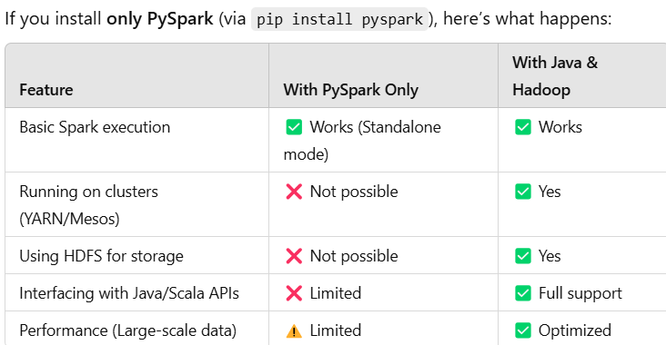
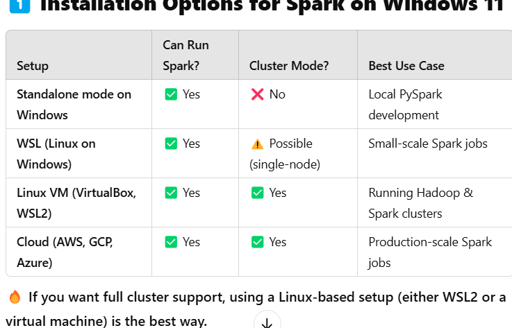
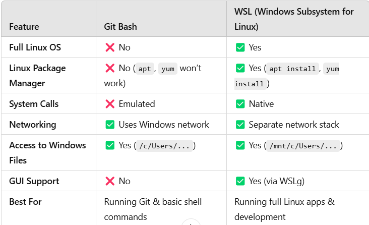

### 1.what will hapeen when I installed pyspark only？
- I installed pyspark only via `pip install pyspark` in my conda env. and set JAVA_HOME.... in this conda env file(See more details in folder about `Databricks SPARK Certification`). \
Only Basic Spark execution works(Standalone mode) \
 \
### 2. Why do we need Java and Hadoop for spark?
Java → Spark is written in Scala (which runs on the JVM(Java Virtual Machine)), so Java is required to execute Spark. \
Hadoop → Not always required, but needed if you want to use HDFS (Hadoop Distributed File System) or run Spark in YARN cluster mode.\

### 3. how to install Spark on a windows laptop?
- Spark natively supports Linux, so running a cluster on Windows is tricky.\
- Hadoop (HDFS, YARN) does not work well on Windows.\
- You'll need WSL (Windows Subsystem for Linux) or a Linux VM for a proper cluster setup.\
 \

### 4. difference between WSL and linux VM?
Both WSL (Windows Subsystem for Linux) and a Linux VM (Virtual Machine) allow you to run Linux on Windows, but they work differently and have different use cases.
#### WSL (Windows Subsystem for Linux)
- WSL is a lightweight Linux compatibility layer inside Windows.
    - __It does not require a separate VM → runs Linux directly inside Windows.__
    - Uses __less RAM & CPU__ compared to a full Linux VM.
    - Best for running Linux commands & scripts inside Windows.
    - No GUI (Graphical Interface) by default (but can be enabled).
- How to install WSL(Ubuntu)?
Powershell: `wsl --install -d Ubuntu-22.04`\
Then, open Ubuntu from the Start Menu and start using Linux!
- list installed WSL distributions: \
  GitBash `wsl --list --verbose`
- check the version of your Ubuntu \
  Ubuntu Command Line: lsb_release -a 
- Notes: \
  Ubuntu also called "remote computer linux machine"
#### a Linux VM
- A Linux Virtual Machine (VM) is a fully virtualized Linux OS running inside Windows.
    - Requires __VirtualBox or VMware__ to create a virtual environment.
    - Uses __more RAM & CPU__ (since __it's a full Linux OS__).
    - Supports GUI applications like browsers & IDEs.
    - Allows cluster setups (multi-node Spark, Hadoop, etc.).
- Install a Linux VM(Ubuntu)
    - Download VirtualBox → https://www.virtualbox.org/wiki/Downloads
    - Download Ubuntu ISO → https://ubuntu.com/download/desktop
    - Install & run Ubuntu inside VirtualBox
### 5. difference between Git BBash and WSL?
#### Git bash
- Git Bash is __a lightweight terminal__ that __provides a Bash shell__ with Unix-like commands __on Windows__.
    - Comes bundled with Git for Windows
    - Simulates a Linux-like environment but isn't a full Linux system
    - Does not support Linux applications (e.g., no apt install)
#### WSL
-WSL is a full-fledged Linux environment running inside Windows.
    -Runs actual Linux distributions (Ubuntu, Debian, etc.)
    -Allows installation of Linux software (apt install, python, docker, etc.)
    -Supports real Linux commands, file systems, and networking
 \ 
#### Which one should you use?
✅ Use Git Bash if you just need Git & Bash commands for simple tasks.
✅ Use WSL if you need a real Linux system with apt, Python, Spark, Docker, etc.

### 6. How to access files in windows Desktop from Ubuntu command line and in verse.
- I have WSL and Git Bash installed in my windows laptop.
    - In WSL(or Ubuntu) Command Line: 
    ```
    momotina18@Ting-Dell-Laptop:~$ cd ~
    momotina18@Ting-Dell-Laptop:~$ pwd
    /home/momotina18
    ```
    - In Git Bash Command Line:
    ```
    tliu1@Ting-Dell-Laptop MINGW64 ~/Desktop
    $ pwd
    /c/Users/tliu1/Desktop
    ```
- How to access tliu1/Desktop in Ubuntu Command Line?
```
momotina18@Ting-Dell-Laptop:~$ cd /mnt/c/Users/tliu1/Desktop
momotina18@Ting-Dell-Laptop:/mnt/c/Users/tliu1/Desktop$ pwd
/mnt/c/Users/tliu1/Desktop
momotina18@Ting-Dell-Laptop:/mnt/c/Users/tliu1/Desktop$ cd ~
momotina18@Ting-Dell-Laptop:~$ pwd
/home/momotina18
```
- How to access home/momotina18 in GitBash Command Line?
```
tliu1@Ting-Dell-Laptop MINGW64 ~
$ pwd
/c/Users/tliu1

tliu1@Ting-Dell-Laptop MINGW64 ~
$ cd //wsl$/Ubuntu/home/momotina18

tliu1@Ting-Dell-Laptop MINGW64 //wsl$/Ubuntu/home/momotina18
$ pwd
//wsl$/Ubuntu/home/momotina18
```
- Summary
In Ubuntu:
    - Linux home directory: /home/momotina18
    - cd Windows home directory: cd /mnt/c/Users/tliu1
In Git Bash:\
    - Windows home directory: /c/Users/tliu1
    - cd Linux home directory: cd //wsl$/Ubuntu/home/momotina18          
        - Using `\\wsl$`: Best way to access WSL file system from Windows applications like Git Bash. 
        - The absolute path is usually(similar to): \    /mnt/c/Users/yourubuntuusername/AppData/Local/Packages/CanonicalGroupLimited.Ubuntu_1804onWindows_79rhkp1fndgsc/LocalState/rootfs/home/yourubuntuusername
            - In this path: /mnt/c/    represents the C: drive in Windows. \
              The rest of the path is the location of your Ubuntu file system from within WSL \ 

### 7 How to open WSL (Ubuntu) system from the Bash command line in Windows
- Using `wsl` command or `wsl -d Ubuntu` command
  
  ```
  -- GitBash
    tliu1@Ting-Dell-Laptop MINGW64 ~
    $ pwd
    /c/Users/tliu1
    
    tliu1@Ting-Dell-Laptop MINGW64 ~
    $ wsl
    To run a command as administrator (user "root"), use "sudo <command>".
    See "man sudo_root" for details.
    
    momotina18@Ting-Dell-Laptop:/mnt/c/Users/tliu1$ pwd
    /mnt/c/Users/tliu1
  ```


